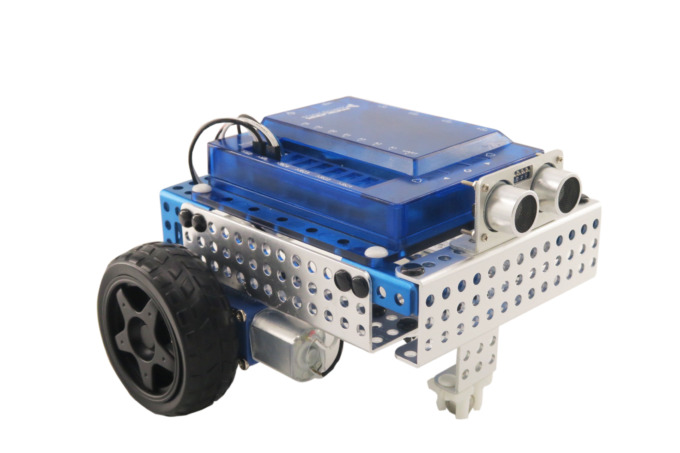
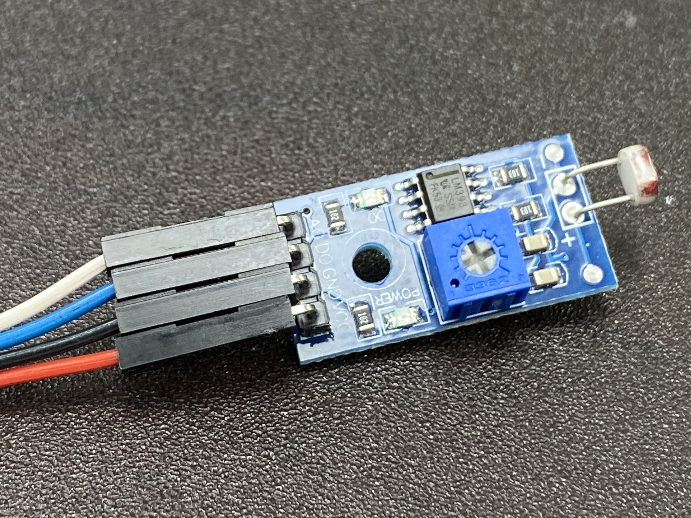
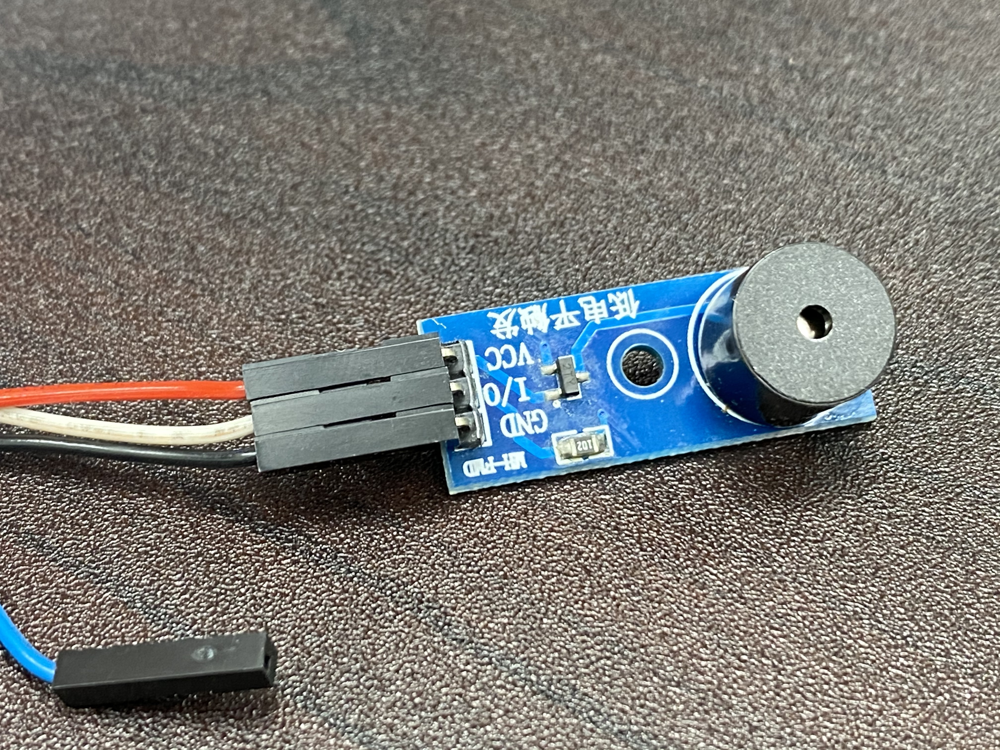

# MR200操控台控制台
[arduino編輯器安裝說明文件](ArduinoInstallation.pdf) 
 
[MINI控制器外觀說明](Matrix_Mini.pdf) 

[MINI控制器腳位定義文件](Mini_Pin_Definition.pdf) 

[MINI小車驅動程式](https://matrixrobotics.com/downloads/matrix-mini/)

[下載sound類別](sound.zip)

[超音波_紅外線安裝說明文件](Sensor_Servo_Assembly.pdf)

### MR200-MINI-小車-組裝影片
[](https://www.youtube.com/playlist?list=PLLVBR5MLJ8AW4XOThhsSQz_84RyxFMdV0)

### 按鈕測試

```c++
#include <MatrixMini.h>

MatrixMini Mini;

void setup() {
  Mini.begin(); 
  Serial.begin(9600);

  Serial.println("\n Matrix Mini Button Test \n");
}

void loop() {
  Serial.print("  Button 1: "); Serial.print(Mini.BTN1.get());
  Serial.print("\tButton 2: "); Serial.print(Mini.BTN2.get());
  Serial.println();
  delay(50);
}
```

### RGBLED測試

```c++
#include <MatrixMini.h>

MatrixMini Mini;

void setup() {
  Mini.begin(); 
  Serial.begin(9600);

  Serial.println("\n Matrix Mini Button LED Test \n");
}

void loop() {
  if(Mini.BTN1.get()) 
    Mini.LED1.setRGB(255,0, 0);
  else
    Mini.LED1.setRGB(0,0, 0);


  if(Mini.BTN2.get()) 
    Mini.LED2.setRGB(0,255, 0);
  else
    Mini.LED2.setRGB(0,0, 0);
  
  delay(50);
}
```

### 直流馬達測試

```c++
#include <MatrixMini.h>

MatrixMini Mini;


void setup() {
  Mini.begin();  // create with the default frequency 1.6KHz
  Serial.begin(9600);           // set up Serial library at 9600 bps

  
  Serial.println("\n Matrix Mini DC Motor Test \n");

  Mini.M1.set(0);
  Mini.M2.set(0);
}


void loop() {
  int i;
  
  Serial.println("One way");
  for (i=-100; i<100; i++) {
    Mini.M1.set(i);  
    Mini.M2.set(i);
    delay(15);
  }
  
  Serial.println("Or another");
  for (i=100; i>-100; i--) {
    Mini.M1.set(i);  
    Mini.M2.set(i);
    delay(15);
  }
  
}
```

### 光敏電阻測試

  

```c++
//使用光敏電阻,檢查目前的亮度
//插入至Ａ1孔
//pin A1-白色線(類比訊號)
//pin A0-藍色線(數位訊號)


#include <MatrixMini.h>
#define LIGHT_SENSOR A1
#define LIGHT_DIGHTOR A0

MatrixMini Mini;

void setup() {
  Mini.begin();
  Serial.begin(9600);
  Serial.println("==========光敏電阻測試==============");
  pinMode(LIGHT_DIGHTOR, INPUT);
}

void loop() {
  Serial.println("==========光敏電阻數位訊號輸出==============");
  bool digitalValue = digitalRead(LIGHT_DIGHTOR);
  Serial.print("數位訊號是:");
  Serial.println(digitalValue);
  Serial.println("\n\n");
  Serial.println("==========光敏電阻類比訊號輸出==============");
  int analogValue = analogRead(LIGHT_SENSOR);
  Serial.print("類比訊號是:");
  Serial.println(analogValue);
  delay(1000);
}
```

### 蜂鳴器測試


```c++
//蜂鳴器
/*
插入到D1孔 
 I/O腳接 pin3
Melody

*/
#define NOTE_B0  31
#define NOTE_C1  33
#define NOTE_CS1 35
#define NOTE_D1  37
#define NOTE_DS1 39
#define NOTE_E1  41
#define NOTE_F1  44
#define NOTE_FS1 46
#define NOTE_G1  49
#define NOTE_GS1 52
#define NOTE_A1  55
#define NOTE_AS1 58
#define NOTE_B1  62
#define NOTE_C2  65
#define NOTE_CS2 69
#define NOTE_D2  73
#define NOTE_DS2 78
#define NOTE_E2  82
#define NOTE_F2  87
#define NOTE_FS2 93
#define NOTE_G2  98
#define NOTE_GS2 104
#define NOTE_A2  110
#define NOTE_AS2 117
#define NOTE_B2  123
#define NOTE_C3  131
#define NOTE_CS3 139
#define NOTE_D3  147
#define NOTE_DS3 156
#define NOTE_E3  165
#define NOTE_F3  175
#define NOTE_FS3 185
#define NOTE_G3  196
#define NOTE_GS3 208
#define NOTE_A3  220
#define NOTE_AS3 233
#define NOTE_B3  247
#define NOTE_C4  262
#define NOTE_CS4 277
#define NOTE_D4  294
#define NOTE_DS4 311
#define NOTE_E4  330
#define NOTE_F4  349
#define NOTE_FS4 370
#define NOTE_G4  392
#define NOTE_GS4 415
#define NOTE_A4  440
#define NOTE_AS4 466
#define NOTE_B4  494
#define NOTE_C5  523
#define NOTE_CS5 554
#define NOTE_D5  587
#define NOTE_DS5 622
#define NOTE_E5  659
#define NOTE_F5  698
#define NOTE_FS5 740
#define NOTE_G5  784
#define NOTE_GS5 831
#define NOTE_A5  880
#define NOTE_AS5 932
#define NOTE_B5  988
#define NOTE_C6  1047
#define NOTE_CS6 1109
#define NOTE_D6  1175
#define NOTE_DS6 1245
#define NOTE_E6  1319
#define NOTE_F6  1397
#define NOTE_FS6 1480
#define NOTE_G6  1568
#define NOTE_GS6 1661
#define NOTE_A6  1760
#define NOTE_AS6 1865
#define NOTE_B6  1976
#define NOTE_C7  2093
#define NOTE_CS7 2217
#define NOTE_D7  2349
#define NOTE_DS7 2489
#define NOTE_E7  2637
#define NOTE_F7  2794
#define NOTE_FS7 2960
#define NOTE_G7  3136
#define NOTE_GS7 3322
#define NOTE_A7  3520
#define NOTE_AS7 3729
#define NOTE_B7  3951
#define NOTE_C8  4186
#define NOTE_CS8 4435
#define NOTE_D8  4699
#define NOTE_DS8 4978


// notes in the melody:
int melody[] = {
  NOTE_C4, NOTE_G3, NOTE_G3, NOTE_A3, NOTE_G3, 0, NOTE_B3, NOTE_C4
};

// note durations: 4 = quarter note, 8 = eighth note, etc.:
int noteDurations[] = {
  4, 8, 8, 4, 4, 4, 4, 4
};

void setup() {
  pinMode(3, OUTPUT);
  digitalWrite(3, LOW);
  // iterate over the notes of the melody:
  for (int thisNote = 0; thisNote < 8; thisNote++) {

    // to calculate the note duration, take one second divided by the note type.
    //e.g. quarter note = 1000 / 4, eighth note = 1000/8, etc.
    int noteDuration = 1000 / noteDurations[thisNote];
    tone(3, melody[thisNote], noteDuration);

    // to distinguish the notes, set a minimum time between them.
    // the note's duration + 30% seems to work well:
    int pauseBetweenNotes = noteDuration * 1.30;
    delay(pauseBetweenNotes);
    // stop the tone playing:
    noTone(3);
    digitalWrite(3, HIGH);
  }
}

void loop() {
  // no need to repeat the melody.
}
```

### 超音波感測器
```c++
//安裝在A1孔
//藍線A0 - Echo
//白線A1 - Trig
//安裝NewPing Library

#include <NewPing.h>
 
#define TRIGGER_PIN  A1
#define ECHO_PIN     A0
#define MAX_DISTANCE 200
 
NewPing sonar(TRIGGER_PIN, ECHO_PIN, MAX_DISTANCE);
 
void setup() {
  Serial.begin(9600);
}
 
void loop() {
  delay(50);
  int uS = sonar.ping();
  Serial.print("Ping: ");
  Serial.print(uS / US_ROUNDTRIP_CM);
  Serial.println("cm");
}
```

### 紅外線感測器
```c++
//人面對背面方向
//D1插孔 - 紅外線左模組
//D2插孔- 紅外線右模組

//白色-0
//黑色-1
#define irLeft 2
#define irRight 3

void setup() {
  // put your setup code here, to run once:
  Serial.begin(9600);
  pinMode(irLeft,INPUT);
  pinMode(irRight,INPUT);
}

void loop() {
  // put your main code here, to run repeatedly:
  int leftValue = digitalRead(irLeft);
  int rightValue = digitalRead(irRight);
  Serial.print("left:");
  Serial.println(leftValue);
  Serial.print("right:");
  Serial.println(rightValue);
  delay(500);
}
```


