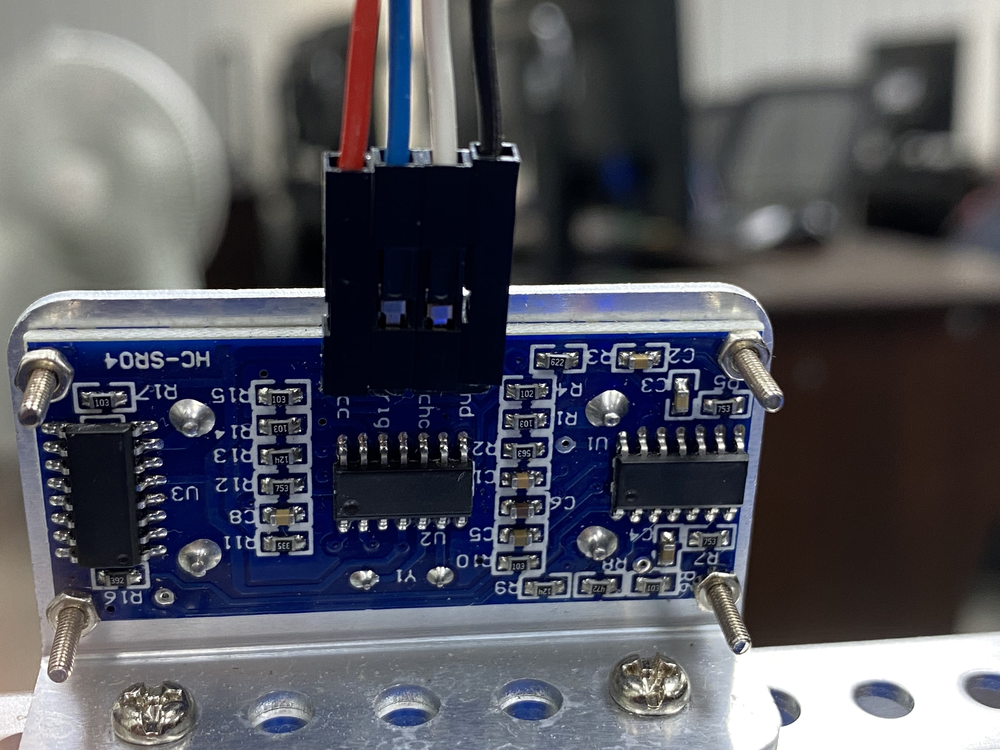

# 10避障車
### 測試旋轉360度
```c++
#include <MatrixMini.h>

MatrixMini Mini;

void setup() {
  Mini.begin();
  oneTurn();
}

void loop() {
  // put your main code here, to run repeatedly:

}

void oneTurn(){
  //轉360
  int interval = 1000;
  int speed = 80;
  Mini.M1.set(speed);
  Mini.M2.set(-speed);
  delay(interval);
  Mini.M1.set(0);
  Mini.M2.set(0);
}

```

### 永不退縮的小車


```c++
//藍線A0 - Trig
//白線A1 - Echo

#include <MatrixMini.h>
#include <NewPing.h>
#define TRIGGER_PIN A0
#define ECHO_PIN A1
#define MAX_DISTANCE 200

MatrixMini Mini;
NewPing sonar(TRIGGER_PIN, ECHO_PIN, MAX_DISTANCE);

void setup() {
  Serial.begin(9600);
  Mini.begin();
  //oneTurn();  
}

void loop() {
  // put your main code here, to run repeatedly:
  detect_distance();
  
}

void detect_distance(){
  //測到距離10cm以內,讓小車前進後退
  delay(200);
  
  int uS = sonar.ping();
  int distance = uS / US_ROUNDTRIP_CM;
  Serial.print("距離:");
  Serial.print(distance);
  Serial.println("cm");
  int interval = 1000;
  int speed = 50;
  
  if(distance <= 10 && distance != 0){
    Mini.M1.set(-speed);
    Mini.M2.set(-speed);
    delay(interval);
    Mini.M1.set(speed);
    Mini.M2.set(speed);
    delay(interval);
    Mini.M1.set(0);
    Mini.M2.set(0);
  }
  
}

void oneTurn(){
  //轉360
  int interval = 1000;
  int speed = 80;
  Mini.M1.set(speed);
  Mini.M2.set(-speed);
  delay(interval);
  Mini.M1.set(0);
  Mini.M2.set(0);
}
```

### 循跡和避障
[循跡和避障](https://youtu.be/lXC5Na7jrWA)

```c++
//小車循跡S區線，終點使用障礙物，讓小車轉一圈後循跡S區線，回到起點
//藍線A0 - Trig
//白線A1 - Echo
//安裝NewPing Library
//人面對背面方向
//D1插孔 - 紅外線左模組
//D2插孔- 紅外線右模組


#include <NewPing.h>
#include <MatrixMini.h>
#include <Thread.h>

#define TRIGGER_PIN A0
#define ECHO_PIN A1
#define MAX_DISTANCE 200
#define irLeft 2
#define irRight 3

NewPing sonar(TRIGGER_PIN,ECHO_PIN,MAX_DISTANCE);
Thread myThread = Thread();
MatrixMini Mini;

void setup() {
  Serial.begin(9600);
  Mini.begin(); 
  pinMode(irLeft,INPUT);
  pinMode(irRight,INPUT);
  //oneTurn();//測試轉一圈
  //while(true);
  myThread.onRun(runS);
  myThread.setInterval(50);
}

void loop() {
  if (goOrStop()){
    if(myThread.shouldRun()){
      myThread.run(); 
    }
  }else{
    //停車
    Mini.M1.set(0);
    Mini.M2.set(0);
    delay(2000);
    oneTurn();
  }
  delay(1);
 
}

bool goOrStop(){
  int uS= sonar.ping();
  int distance = uS / US_ROUNDTRIP_CM;
  
  Serial.print("Ping: ");
  Serial.print(uS / US_ROUNDTRIP_CM);
  Serial.println("cm");
  if (distance == 0){
    return true;
  }
  return (distance > 10) ?  true : false;  
}

void runS(){
  Serial.println("runS");
  int leftValue = digitalRead(irLeft);
  int rightValue = digitalRead(irRight);
  int speed = 70;
  int g = 40;
  if(leftValue == 0 && rightValue == 0){
    //直線
    running(speed, speed);
    Serial.println("直線");
  }else if(leftValue == 0 && rightValue == 1){
    //右轉
    running(speed, speed-g);
    Serial.println("右轉");
  }else if(leftValue == 1 && rightValue == 0){
    //左轉
    running(speed-g, speed);
    Serial.println("左轉");
  }
}

void running(int leftMotor, int rightMotor){
  //M1 = 左輪
  //M2 = 右輪
  Mini.M1.set(leftMotor);
  Mini.M2.set(rightMotor);
}

void oneTurn(){
  //轉180
  int interval = 1850;
  int speed = 30;
  Mini.M1.set(speed);
  Mini.M2.set(-speed);
  delay(interval);
  Mini.M1.set(0);
  Mini.M2.set(0);
 
}

```
### 取得360度測試的距離
```c++
//藍線A0 - Trig
//白線A1 - Echo
//安裝NewPing Library

#include <NewPing.h>
#include <MatrixMini.h>
#define TRIGGER_PIN  A0
#define ECHO_PIN     A1
#define MAX_DISTANCE 200
 
NewPing sonar(TRIGGER_PIN, ECHO_PIN, MAX_DISTANCE);
MatrixMini Mini;
unsigned long startTime;
void setup() {
  Mini.begin(); 
  Serial.begin(9600);
  detect();
}
 
void loop() {
  
}


void detect(){
  //要先手動測試interval的時間是否剛好轉一圈
  //要使用電池在地上測試  
  int interval = 6500;
  int speed = 20;
  int n=0;
  Mini.M1.set(speed);  
  Mini.M2.set(-speed);
  startTime = millis();
  unsigned long startTime1 = millis();
  unsigned long times[20]; //儲存時間陣列
  //儲存距離陣列
  int distances[20]= {0, 0, 0, 0, 0, 0, 0, 0, 0, 0, 0, 0, 0, 0, 0, 0, 0, 0, 0, 0};
  while(true){
    //轉一圈的時間,要取得20個值
    unsigned long currentTime = millis();  
    if(currentTime - startTime1 >= interval/20){      
      recordTimeAndDisctance(times, distances, n);     
      n++; //小車旋轉1圈,超音波偵測的次數      
      startTime1 = currentTime;
    }
    
   
    //小車旋轉interval的時間
    if(millis() - startTime >= interval){
       Mini.M1.set(0);  
       Mini.M2.set(0);       
      break;
    }
  }
  //輸出測試距離和時間
  for(int i=0; i<n ; i++){
    Serial.println(times[i]);
    Serial.println(distances[i]);
  }
}

void recordTimeAndDisctance(unsigned long ts[], int ds[], int n){
  //n會0-19
  ts[n] = millis();  
  int uS = sonar.ping();
  int distance = uS / US_ROUNDTRIP_CM;
  //如果距離為0代表超過測試距離就使用最大測試距離
  ds[n] = distance == 0 ? MAX_DISTANCE : distance;
}

```


### 分析那一個時間的距離最遠
```c++
//藍線A0 - Trig
//白線A1 - Echo
//安裝NewPing Library

#include <NewPing.h>
#include <MatrixMini.h>
#define TRIGGER_PIN  A0
#define ECHO_PIN     A1
#define MAX_DISTANCE 200
 
NewPing sonar(TRIGGER_PIN, ECHO_PIN, MAX_DISTANCE);
MatrixMini Mini;
unsigned long startTime;
void setup() {
  Mini.begin(); 
  Serial.begin(9600);
  detect();
}
 
void loop() {
  
}


void detect(){
  //要先手動測試interval的時間是否剛好轉一圈  
  int interval = 7200;
  int speed = 20;
  int n=0;
  Mini.M1.set(speed);  
  Mini.M2.set(-speed);
  startTime = millis();
  unsigned long startTime1 = millis();
  unsigned long times[20]; //儲存時間陣列
  //儲存距離陣列
  int distances[20]= {0, 0, 0, 0, 0, 0, 0, 0, 0, 0, 0, 0, 0, 0, 0, 0, 0, 0, 0, 0};
  while(true){
    //轉一圈的時間,要取得20個值
    unsigned long currentTime = millis();  
    if(currentTime - startTime1 >= interval/20){      
      recordTimeAndDisctance(times, distances, n);     
      n++; //小車旋轉1圈,超音波偵測的次數      
      startTime1 = currentTime;
    }
    
   
    //小車旋轉interval的時間
    if(millis() - startTime >= interval){
       Mini.M1.set(0);  
       Mini.M2.set(0);       
      break;
    }
  }
  for(int i=0; i<n ; i++){
    Serial.println(times[i]);
    Serial.println(distances[i]);
  }

  //開始分析
  turnRightDirection(times,distances, startTime, interval);
}

void recordTimeAndDisctance(unsigned long ts[], int ds[], int n){
  //n會0-19
  ts[n] = millis();
  
  int uS = sonar.ping();
  int distance = uS / US_ROUNDTRIP_CM;
  //如果距離為0代表超過測試距離就使用最大測試距離
  ds[n] = distance == 0 ? MAX_DISTANCE : distance;
}

void turnRightDirection(unsigned long ts[], int ds[],unsigned long beginTime,int interval){
  
  //取得最大值
  int maxValue = 0;
  Serial.println("==========================");
  for(int i=0; i<20; i++){
    maxValue = max(ds[i], maxValue);
    Serial.println(maxValue);
  }

  Serial.println("==========================");
  Serial.println(maxValue);


  //計算maxValue的數量
  int count=0;
  for(int i=0; i<20; i++){
    if(maxValue == ds[i]){
      count++;
    }
  }
 Serial.println("==========================");
 Serial.print("maxValue");
 Serial.println(count);
 //建立出maxValue的時間陣列
 unsigned long maxValueTimes[count];
 int n=0;
 for(int i=0; i<20; i++){
    if(maxValue == ds[i]){
      maxValueTimes[n] == ts[i];
      n++;
    }
  }
  
Serial.println("==========================");
 for(int i=0; i<count; i++){  
  Serial.print("maxValueTime");
  Serial.println(maxValueTimes[i]);
 }
  
}


```

### 避障(偵測無障礙空間)
[避障(偵測無障礙空間)](https://youtu.be/HxvQXAvaBUI)

```c++
//藍線A0 - Trig
//白線A1 - Echo
//安裝NewPing Library

#include <NewPing.h>
#include <MatrixMini.h>
#define TRIGGER_PIN  A0
#define ECHO_PIN     A1
#define MAX_DISTANCE 200
 
NewPing sonar(TRIGGER_PIN, ECHO_PIN, MAX_DISTANCE);
MatrixMini Mini;
unsigned long startTime;
int detectSpeed = 20; //設定偵測的速度
int runSpeed = 50;
void setup() {
  Mini.begin(); 
  Serial.begin(9600);
  detect();
}
 
void loop() {
  int uS = sonar.ping();
  int distance = uS / US_ROUNDTRIP_CM;
  if(distance < 15 && distance >0){
    Mini.M1.set(-35);  
    Mini.M2.set(-35);
    delay(1000);
    detect();
  }else{
    Mini.M1.set(runSpeed);  
    Mini.M2.set(runSpeed);
  }
  delay(10);
}


void detect(){
  //要先手動測試interval的時間是否剛好轉一圈  
  int interval = 7200;
  
  int n=0;
  Mini.M1.set(detectSpeed);  
  Mini.M2.set(-detectSpeed);
  startTime = millis();
  unsigned long startTime1 = millis();
  unsigned long times[20]; //儲存時間陣列
  //儲存距離陣列
  int distances[20]= {0, 0, 0, 0, 0, 0, 0, 0, 0, 0, 0, 0, 0, 0, 0, 0, 0, 0, 0, 0};
  while(true){
    //轉一圈的時間,要取得20個值
    unsigned long currentTime = millis();  
    if(currentTime - startTime1 >= interval/20){      
      recordTimeAndDisctance(times, distances, n); 
      if(n==19){         
        break;    
      }
      n++; //小車旋轉1圈,超音波偵測的次數   
         
      startTime1 = currentTime;
    }
    
   
    //小車旋轉interval的時間
    /*
    if(millis() - startTime >= interval){
       Mini.M1.set(0);  
       Mini.M2.set(0);       
      break;
    }
    */
  }
  for(int i=0; i<n ; i++){
    Serial.println(times[i]);
    Serial.println(distances[i]);
  }

  //開始分析
  Serial.print("startTime:");
  Serial.println(startTime);
  rightDirection(times,distances, startTime, interval);
  
}

void recordTimeAndDisctance(unsigned long ts[], int ds[], int n){
  //n會0-19
  ts[n] = millis();
  
  int uS = sonar.ping();
  int distance = uS / US_ROUNDTRIP_CM;
  //如果距離為0代表超過測試距離就使用最大測試距離
  ds[n] = distance == 0 ? MAX_DISTANCE : distance;
}

//取出最遠距離的時間(陣列)
void rightDirection(unsigned long ts[], int ds[],unsigned long beginTime,int interval){
  
  //取得最大值
  int maxValue = 0;
  Serial.println("==========================");
  for(int i=0; i<20; i++){
    //8-12是正後方,不處理
    
    switch(i){
      case 8:
      case 9:
      case 10:
      case 11:
      case 12:
      continue;
    }
    
    maxValue = max(ds[i], maxValue);
    Serial.println(maxValue);
  }

  Serial.println("==========================");
  Serial.println(maxValue);


  //計算maxValue的數量
  int count=0;
  for(int i=0; i<20; i++){
    if(maxValue == ds[i]){
      count++;
    }
  }
 Serial.println("==========================");
 Serial.print("maxValue");
 Serial.println(count);
 //建立出maxValue的時間陣列
 unsigned long maxValueTimes[count];
 int n=0;
 for(int i=0; i<20; i++){
    if(maxValue == ds[i]){
      maxValueTimes[n] = ts[i];      
      n++;
    }
  }
  
Serial.println("==========================");
//列印出距離最遠的時間
 for(int i=0; i<count; i++){  
  Serial.print("maxValueTime");
  Serial.println(maxValueTimes[i]);
 }

 //取最大時間陣列的第一個數值
 //並計算起始時間和第一個數值的時間差

 unsigned long moveDistance = maxValueTimes[count/2] - beginTime;
 Serial.print("beginTime:");
 Serial.println(beginTime);
 Serial.print("maxValueTimes[0]:");
 Serial.println(maxValueTimes[0]);
 Serial.println("=================");
 Serial.print("moveDistance:");
 Serial.println(moveDistance);
 if(moveDistance < interval/2){
  //距離順時鐘較近
  unsigned long currentTime = millis();
  Mini.M1.set(detectSpeed);  
  Mini.M2.set(-detectSpeed);
  while(true){    
    if(millis()-currentTime >= moveDistance ){
        Mini.M1.set(0);  
        Mini.M2.set(0);
        break; 
    }
  }
  
 }else{
  //距離反時鐘較近
  unsigned long currentTime = millis();
  Mini.M1.set(-detectSpeed);  
  Mini.M2.set(detectSpeed);
  
  while(true){    
    if(millis()-currentTime >= (interval - moveDistance) ){
        Mini.M1.set(0);  
        Mini.M2.set(0);
        break;   
    }
  }
 }
 
}

```