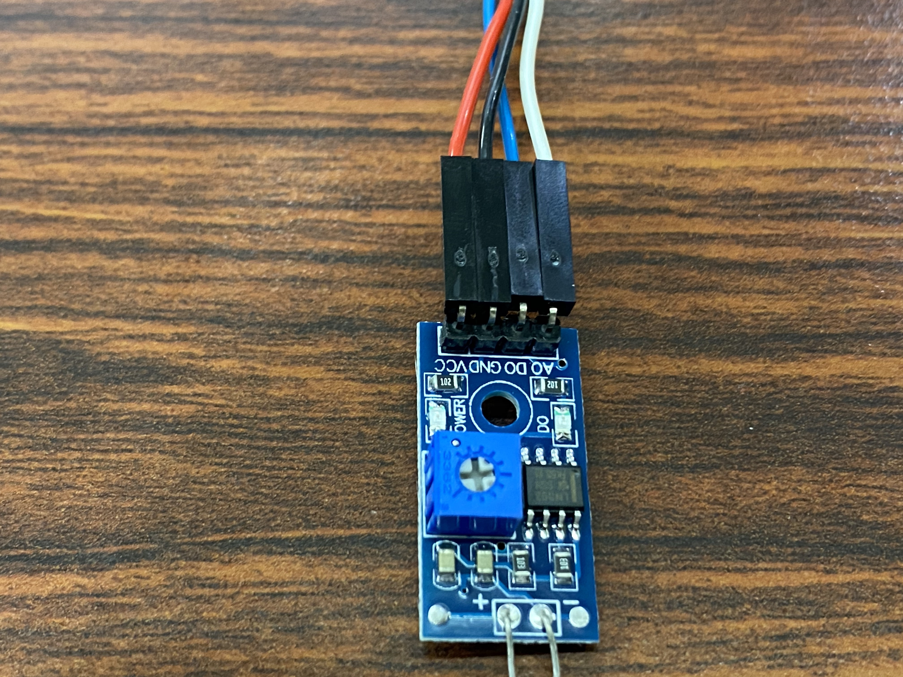

# 光線感測流程判斷
## 比較運算子
a| 運算子 | 意義 
-|---|--- 
a|== | 內容相等 
a|!= | 內容不相等 
a|> | 大於 
a|< | 小於 
a|>= | 大於等於 
a|<= | 小於等於 

## 流程控制
```
arduinoC的流程控制的指令分為2部份
1判斷(if else,switch case)
2迴圈(for,whiel,do..while)
```
```
if(條件式){
  程式區塊
  ......
}
```
## 單向選擇(if...)

```c++
//arduinoC
void setup() {
  Serial.begin(9600);
  String password;
  Serial.println("請輸入密碼:");

  while(true){
    if(Serial.available()){
      password = Serial.readString();
      if(password == "1234"){
        Serial.println("密碼正確!歡迎光臨!");        
      }
    }
  }
}

void loop() {
  // put your main code here, to run repeatedly:

}
```

## 雙向選擇(if ... else)

```c++
if (條件式){
    程式區塊一
}else{
    程式區塊二
}

//========================================================

請輸入密碼:5678
密碼錯誤,請重新輸入

//========================================================

//arduinoC
void setup() {
  Serial.begin(9600);
  String password;
  Serial.println("請輸入密碼:");

  while(true){
    if(Serial.available()){
      password = Serial.readString();
      if(password == "1234"){
        Serial.println("密碼正確!歡迎光臨!");
        break;        
      }else{
        Serial.println("密碼錯誤!請重新輸入!");
      }
    }
  }
}

void loop() {
  // put your main code here, to run repeatedly:

}
```


```c++
*question 
成績及格判斷
請使用者輸入成績，若成績大於等於60分，則LED1顯示綠燈，否則LED1顯示紅燈。

顯示:
請輸入成績:78
及格!(不及格!)
```

```
//arduinoC
#include <MatrixMini.h>
MatrixMini Mini;
void setup() {
  Mini.begin();
  Mini.LED1.setRGB(0, 0, 0);
  Serial.begin(9600);
  unsigned int score;
  Serial.println("請輸入成績:"); 
}

void loop() {
  if(Serial.available()){
    int score = Serial.parseInt();
      if (score >= 60){
        Serial.println("及格!");
        Mini.LED1.setRGB(0, 255, 0);
      }else{
        Serial.println("不及格!");
        Mini.LED1.setRGB(255, 0, 0);
      }
  }

}

```

```c++
*作業
試用if-else敘述，選寫一個判斷輸入的數字為奇數(LED1亮綠燈)或偶數(LED2亮綠燈)的程式,

顯示=============
請輸入數字:15
您輸入的15是奇數
```
[解題](./odd_even/odd_even.ino)


## 多向選擇(if ... else if..... else)
```c++

if (條件式一){
    程式區塊一
}else if(條件式二){
    程式區塊二
}else if(條件式三){
     程式區塊三
}else{
    程式區塊else
}


//========================================================

請輸入購買金額:130000
實付金額是:104000元

//========================================================


// Name        : discount.ino
//輸入顧客購買金額，若金額在100000元打8折，50000打85折，30000打9折，10000打95折

//ArduinoC
void setup() {
  Serial.begin(9600);
  Serial.print("請輸入購買金額:");  
}

void loop() {
  //必需使用long, 不然會超出範圍
  long money;
  long payMoney;
  if(Serial.available()){
      money = Serial.parseInt();
      Serial.print("您購買的金額是:");
      Serial.println(money);
      
      if(money >= 100000){
        payMoney = money * 0.8;
      }else if(money >= 50000){
        payMoney = money * 0.85;
      }else if(money >= 30000){
        payMoney = money * 0.9;
      }else if (money >= 10000){
        payMoney = money * 0.95;
      }else{
        payMoney = money;
      }
      Serial.print("實付金額是:");
      Serial.print(payMoney);
      Serial.println("元");   
      Serial.println("========================");
  }

}
```



```c++
*question light.ino
*使用光敏電阻,檢查目前的亮度
*插入至Ａ1孔
//小於等於100 很亮
//小於等於200,大於100 亮
//小於等於400,大於200有點亮
//小於等於600,大於400有點暗
//小於等於800,大於600暗
//小於等於1023,大於800 很暗
*當狀態改變時，請閃爍一下LED2

#include <MatrixMini.h>
#define LIGHT_SENSOR A1
#define LIGHT_DIGITOR A0

MatrixMini Mini;

String state;
String preState="";

void setup() {
  Mini.begin();
  Serial.begin(9600);
  pinMode(LIGHT_DIGITOR, INPUT);  
}

void loop() {
  // put your main code here, to run repeatedly:
  int analogValue = analogRead(A1);
  
  if(analogValue<100){
    state = "很亮";
  }else if (analogValue<200){
    state = "亮";
  }else if (analogValue<400){
    state = "有點亮";
  }else if(analogValue<600){
    state = "有點暗";
  }else if(analogValue<800){
    state = "暗";
  }else{
    state = "很暗";
  }

  if (state != preState){
    Serial.println("狀態改變");
    Mini.LED2.setRGB(255,0, 0);
    delay(500);
    Mini.LED2.setRGB(0,0, 0);
    preState = state;
  }
  
  Serial.println(state);
  delay(500);
}
```


## switch case:

```c++
switch(表示式){
    case value1:
        程式區塊1
		break;
    case value2:
        程式區塊2
		break;
    case valueN:
        程式區塊n
		break;
    default:
        程式區塊
	
}


//========================================================

num1=20,num2=4
請輸入要執行的運算(+ - * /):+
num1+num2=24

//========================================================


// Name        : calculate.ino
//讓使用者輸入加、減、乘、除運算子, 就會顯示運算結果

byte num1=20;
byte num2=4;
void setup() {
  Serial.begin(9600);
  Serial.println("num1=20, num2=4");
  Serial.println("請輸入要執行的運算(+, -, *, /):");
  
}

void loop() {
  if(Serial.available()){
     char op = Serial.read();
     switch(op){
      case '+':
        Serial.print("num1+num2=");
        Serial.println(num1+num2);
        break;
      case '-':
        Serial.print("num1-num2=");
        Serial.println(num1-num2);
        break;
        
      case '*':
        Serial.print("num1*num2=");
        Serial.println(num1*num2);
        break;
        
      case '/':
        Serial.print("num1/num2=");
        Serial.println(num1/num2);
        break;
        
      default:
        Serial.println("default");
     }
  }

}

```

```c++
*作業
請使用三元運算子? : 製作一個判斷奇偶數的程式，程式的執行結果。如果是奇數，讓蜂鳴器響一次


顯示========
請輸入任意整數:50
您這個數是:偶數
```
[解題](./ternary/ternary.ino)

```c++
//按左按鈕,左燈亮
//按右按鈕,右燈亮

#include <MatrixMini.h>
MatrixMini Mini;

void setup() {
  Mini.begin();
  Serial.begin(9600);
}

void loop() {
  switch(Mini.BTN1.get()){
    case 1:
      Mini.LED1.setRGB(255,0,0);
      break;
    case 0:
      Mini.LED1.setRGB(0,0,0);
  }

  switch(Mini.BTN2.get()){
    case 1:
      Mini.LED2.setRGB(255,0,0);
      break;
    case 0:
      Mini.LED2.setRGB(0,0,0);
  }
  

}
```

## 邏輯運算子 
| ! | not |
|:--|:--|
| && | and |
| 2直線 | or |

### 使用邏輯運算子
```c++
//同時按下左按鈕和右按鈕蜂鳴器會呼叫
//使用邏輯運算子 &&
//使用MatrixMini,只可以使用D4,D1,D2,D3都被pullup,所以蜂鳴器要安裝在D4

#include <MatrixMini.h>
#define buzzer 6
MatrixMini Mini;

void setup() {  
  Mini.begin();
  Serial.begin(9600);
  pinMode(buzzer, OUTPUT);
  digitalWrite(buzzer, HIGH);
}

void loop() {
  if(Mini.BTN1.get() && Mini.BTN2.get()){
    digitalWrite(buzzer,LOW);
  }else{
    digitalWrite(buzzer,HIGH);
  }
  
}
```
### 使用巢狀判斷
```c++
//同時按下左按鈕和右按鈕蜂鳴器會呼叫
//使用巢狀判斷
//使用MatrixMini,只可以使用D4,D1,D2,D3都被pullup

#include <MatrixMini.h>
#define buzzer 6
MatrixMini Mini;

void setup() {  
  Mini.begin();
  Serial.begin(9600);
  pinMode(buzzer, OUTPUT);
  digitalWrite(buzzer, HIGH);
}

void loop() {
  if(Mini.BTN1.get()){
    if(Mini.BTN2.get()){
      digitalWrite(buzzer,LOW);
    }else{
      digitalWrite(buzzer,HIGH);   
    }
  }else{
    digitalWrite(buzzer,HIGH);
  }
  
}
```
