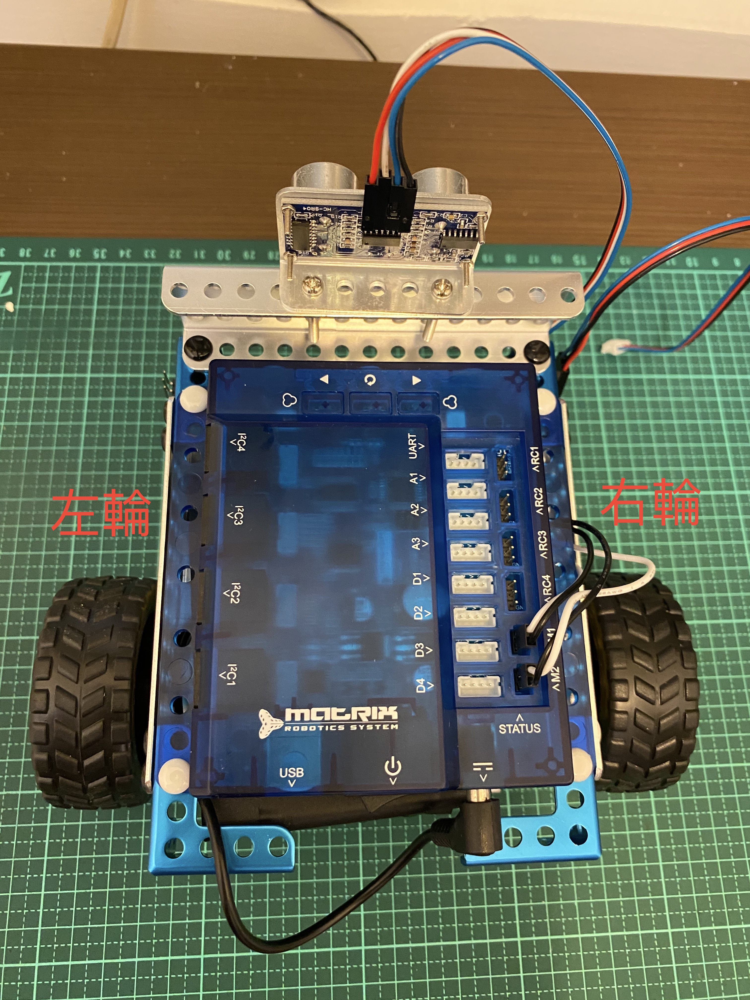

# 8加速_換檔_推進器


```
//M1 = 左輪
//M2 = 右輪
M1,M2接線圖,黑白線不行接反

```


```
//停止0

//慢速30
//中速50
//快速75
//高速100

//慢速後退-30
//中速後退-50
//快速後退-75
//高速後退-100
```

```c++
// Name        : car.ino
//以4種速度前進或後退3秒

#include <MatrixMini.h>

MatrixMini Mini;
void setup() {
  Mini.begin();  // create with the default frequency 1.6KHz
  Serial.begin(9600);           // set up Serial library at 9600 bps

  
  Serial.println("\n Matrix Mini DC Motor Test \n");
  int i=30;
  
  Mini.M1.set(i);  
  Mini.M2.set(i);
  delay(3000);
  Mini.M1.set(0);
  Mini.M2.set(0);
}


void loop() { 
  
}
```

```c++
// Name        : car.ino
//以4種速度旋轉3秒

#include <MatrixMini.h>

MatrixMini Mini;
void setup() {
  Mini.begin();  // create with the default frequency 1.6KHz
  Serial.begin(9600);           // set up Serial library at 9600 bps

  
  Serial.println("\n Matrix Mini DC Motor Test \n");
  int i=30;
  
  Mini.M1.set(i);  
  Mini.M2.set(-i);
  delay(3000);
  Mini.M1.set(0);
  Mini.M2.set(0);
}


void loop() { 
  
}
```


```c++
// Name        : car2.ino

#include <MatrixMini.h>
//前進3秒右轉1秒前進3秒
MatrixMini Mini;
void setup() {
  Mini.begin();  // create with the default frequency 1.6KHz
  Serial.begin(9600); // set up Serial library at 9600 bps  
  Serial.println("\n Matrix Mini DC Motor Test \n");
  
    
  Mini.M1.set(30);  
  Mini.M2.set(30);
  delay(3000);
  Mini.M1.set(30+20);  
  Mini.M2.set(30);
  delay(1000);
  Mini.M1.set(30);  
  Mini.M2.set(30);
  delay(3000);
  Mini.M1.set(0);
  Mini.M2.set(0);
}


void loop() { 
  
}
```

```c++
#include <MatrixMini.h>
//前進3秒左轉2秒前進3秒
MatrixMini Mini;
void setup() {
  Mini.begin();  // create with the default frequency 1.6KHz
  Serial.begin(9600); // set up Serial library at 9600 bps  
  Serial.println("\n Matrix Mini DC Motor Test \n");
  
  int i = 30;
  Mini.M1.set(i);  
  Mini.M2.set(i);
  delay(3000);
  Mini.M1.set(i);  
  Mini.M2.set(i+20);
  delay(2000);
  Mini.M1.set(i);  
  Mini.M2.set(i);
  delay(3000);
  Mini.M1.set(0);
  Mini.M2.set(0);
}


void loop() { 
  
}

```

```c++
//將光敏電阻插入至A1
#define LIGHT_SENSOR A1
#define LIGHT_DIGITOR A0

//一開始要取得目前光線的平均值
//光線變暗時,向左或向右旋轉3秒
MatrixMini Mini;

int lightAvg;
void setup() {
  Mini.begin();  // create with the default frequency 1.6KHz
  Serial.begin(9600); // set up Serial library at 9600 bps  
  Serial.println("\n Matrix Mini DC Motor Test \n");
  long lightTotal=0;
  for(int i=0; i<10; i++){
     lightTotal += analogRead(LIGHT_SENSOR);
  }
  lightAvg = lightTotal/10;
  Serial.print("目前光線平均強度");
  Serial.println(lightAvg);
}
void loop() { 
  Serial.println(analogRead(LIGHT_SENSOR));
  int currentLight = analogRead(LIGHT_SENSOR);
  int distance = currentLight - lightAvg;
  if(distance > 100){
    switch(distance%2){
      case 0:
        turn(30);
        break;
      case 1:
        turn(-30);
        break;
    }      
  }
  delay(500);
}

void turn(int i){  
  Mini.M1.set(i);  
  Mini.M2.set(-i);
  delay(3000);
  Mini.M1.set(0);
  Mini.M2.set(0);
}
```
